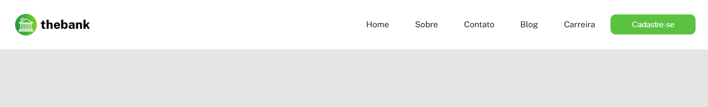
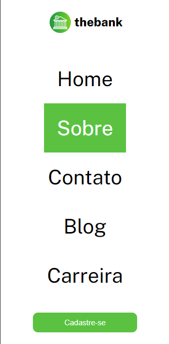

# Menu responsivo com Flexbox 


Esta é uma solução para o exercício proposto na aula de CSS Avançado - Flexbox. 

## Índice

- [Overview](#overview)
  - [O exercício](#o-exercicio)
  - [Print do projeto](#print-do-projeto)
  - [Link](#link)
- [Meu processo](#meu-processo)
  - [Construído com](#construido-com)
  - [O que aprendi](#o-que-aprendi)
  - [Desenvolvimento contínuo](#desenvolviment-continuo)
- [Autora](#autora)
- [Agradecimentos](#agradecimentos)

## Overview

### O exercício

O exercício constiste em:

- testar nossos conhecimentos com front-end, mas expecificadamente o CSS, na parte de flexbox;
- mostrar nossa capacidade em utilizar as propriedades relacionadas ao flex e seus atributos;
- responsividade com media querie;

### Print do projeto

Desktop

 

Mobile

 

### Link

- Código do desenvolvimento: [Menu](https://github.com/maiarasteffen/menu-flexbox)
- Front do projeto: [Front]()

## Meu processo

### Construído com

- Semântica HTML;
- Propriedades CSS;
- Flexbox;
- Media querie;

### O que aprendi

Aprendi como utilizar e centralizar os elementos como flexbox, propriedades mais usadas foram: display, justify-content e align-itens.

Código utilizado:

```html
<body>
    <header class="container">
        <div class="logo">
            
            <h2>thebank</h2>
        </div>
        <nav class="menu">
            <ul>
                <li>Home</li>
                <li>Sobre</li>
                <li>Contato</li>
                <li>Blog</li>
                <li>Carreira</li>
            </ul>
            <button>Cadastre-se</button>
        </nav>
    </header>
</body>
```
```css
body {
    background-color: #e5e5e5;
    font-family: 'Public Sans', sans-serif;
    max-width: 1421px;
    display: flex;
    
}

.container {
    background-color: #fff;
    display: flex;
    justify-content: space-between;
    align-items: center;
    padding: 25px;
    width: 100%;
}

.container .logo {
    display: flex;
    justify-content: flex-start;
    align-items: center;
}

.container .logo h2 {
    font-weight: 800;
    margin-left: 5px;
}

.container .menu {
    display: flex;
}

.container .menu ul {
    display: flex;
    align-items: center;
    justify-content: center;
    width: 100%;
    margin-right: 5px;
}

.container .menu ul li {
    padding: 10px 25px;
    cursor: pointer;
    transition: 0.3s;
}

.container .menu ul li:hover {
    background-color: #5BC241;
    color: #fff;
}

.container .menu button {
    padding: 0 40px;
    border: 1px solid #5BC241;
    border-radius: 10px;
    font-size: 15px;
    text-align: start;
    color: #fff;
    background-color: #5BC241;
    cursor: pointer;
    width: 100%;
    transition: 0.3s;
}

.container .menu button:hover {
    border: 1px solid #5BC241;
    background-color: #fff;
    color: #000;
}

@media (max-width: 860px) {
    .container {
        flex-direction: column;
    }

    .container .menu {
        flex-direction: column;
        margin-top: 40px;
    }

    .container .menu ul {
        flex-direction: column;
    }

    .container .menu ul li {
        font-size: 40px;
        padding: 25px;
    }

    .container .menu button {
        padding: 10px 40px;
        margin-top: 25px;
        text-align: center;
    }
}


```

### Desenvolvimento contínuo

Irei continuar me aperfeiçoando na parte de CSS, focando no Flexbox e Grid. Além de estilizar elementos com pseudo-elementos. Também daqui em diante irei me aperfeiçoar na área de React Native e Rest API com Node.js! Por isso estou treinando bem a base do Front-end!

## Author

- Linkedin - [Maiara Steffen](https://www.linkedin.com/in/maiara-steffen/)
- Frontend Mentor - [@maiarasteffen](https://www.frontendmentor.io/profile/maiarasteffen)
- Instagram - [@maiara_steffen](https://www.instagram.com/maiara_steffen/)
- GitHub - [@maiarasteffen](https://github.com/maiarasteffen/)

## Agradecimentos

Primeiro quero agradecer muito a Deus por sempre estar me dando oportunidades de me desenvolver cada vez mais na carreira de programadora, também quero agradecer muito ao [Dev Em Dobro](https://www.instagram.com/devemdobro/), os irmãos que me ensinam muitas pessoas a se desenvolverem e crescerem no mercado de trabalho como programador!